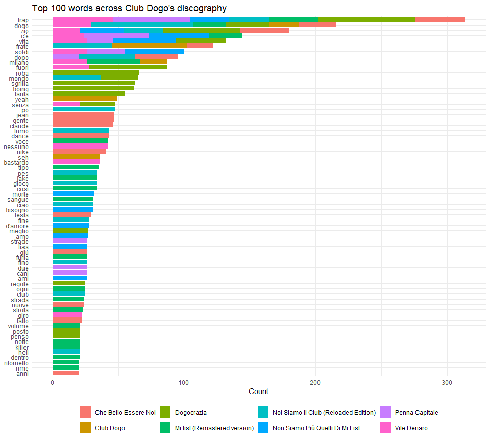
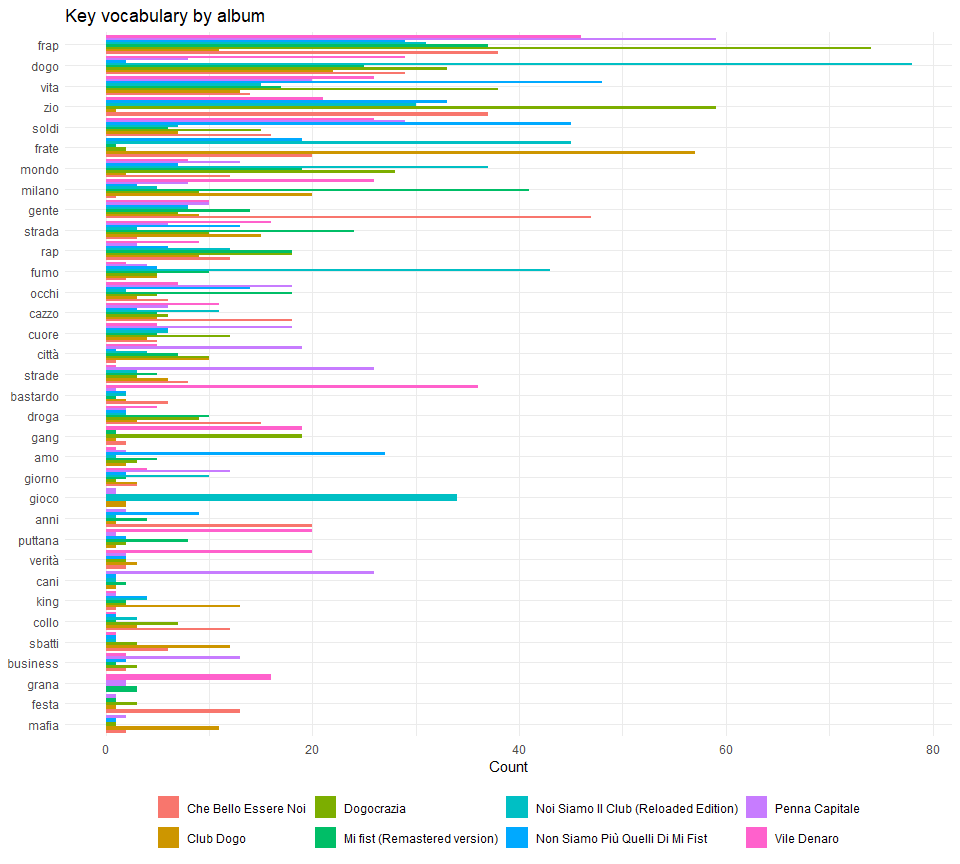
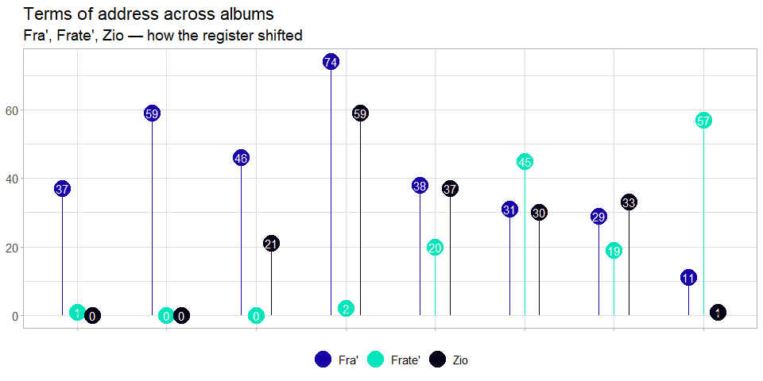
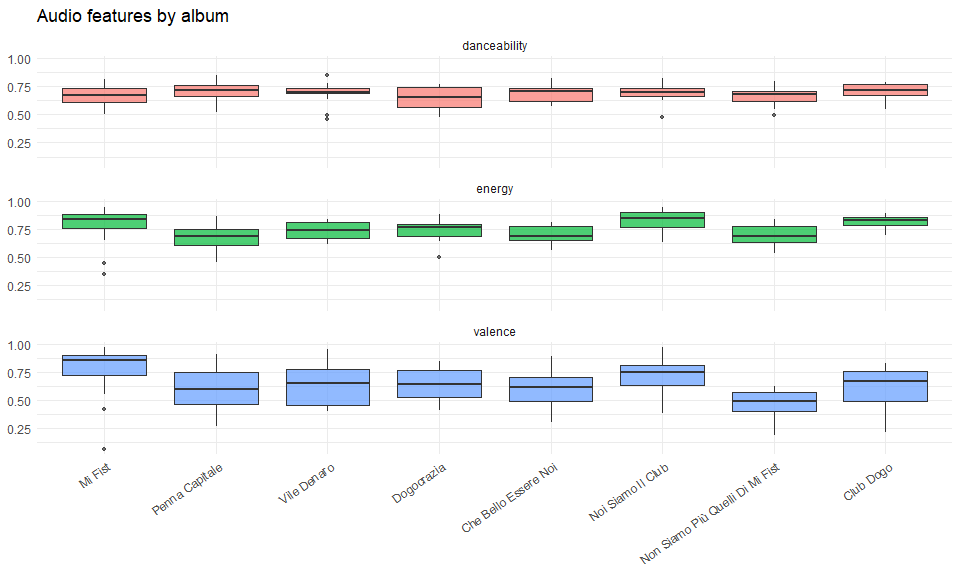

dogofieRo
================
Maria Ascolese
2026-05-16

- [Overview](#overview)
- [Setup](#setup)
  - [Credentials](#credentials)
- [Data collection](#data-collection)
  - [Spotify audio features](#spotify-audio-features)
  - [Album selection](#album-selection)
  - [Lyrics scraping](#lyrics-scraping)
- [Text preprocessing](#text-preprocessing)
  - [Stopwords](#stopwords)
  - [Slang normalization](#slang-normalization)
  - [Tokenization](#tokenization)
- [Analysis](#analysis)
  - [Top words by album](#top-words-by-album)
  - [Key vocabulary across albums](#key-vocabulary-across-albums)
  - [Fra’, Frate’, Zio — terms of address over
    time](#fra-frate-zio--terms-of-address-over-time)
  - [KWIC — words in context](#kwic--words-in-context)
- [Audio features](#audio-features)
- [Notes](#notes)

## Overview

Club Dogo is one of the most influential Italian rap groups of the
2000s: a trio from Milan (Guè, Jake La Furia, Don Joe) whose discography
spans over a decade and eight studio albums.

This analysis combines two data sources:

- **Spotify** (via `spotifyr`): audio features — energy, valence,
  danceability, tempo — for each track
- **Genius** (via `geniusr`): full lyrics for each track, scraped and
  cleaned

The goal is to explore how Club Dogo’s language and sound evolved across
albums, and to find patterns in the vocabulary that define their style.

------------------------------------------------------------------------

## Setup

``` r
library(tidyverse)
library(spotifyr)
library(geniusr)
library(tidytext)
library(rvest)
library(xml2)
library(quanteda)
library(extrafont)
library(knitr)
```

### Credentials

``` r
# In .Renviron:
# SPOTIFY_CLIENT_ID=your_id
# SPOTIFY_CLIENT_SECRET=your_secret
# GENIUS_API_TOKEN=your_token

access_token <- get_spotify_access_token()
genius_token(force = TRUE)
```

------------------------------------------------------------------------

## Data collection

### Spotify audio features

``` r
club_dogo <- get_artist_audio_features("club dogo")
write_csv2(club_dogo, "cd.csv")
```

``` r
club_dogo <- read_csv2("cd.csv")
```

### Album selection

We keep the eight canonical studio albums, dropping reissues,
anniversary editions, and compilations.

``` r
exclude <- c(
  "Vile Denaro (Plus Tornerò Da Re Parte II)",
  "Vile Denaro 10th Anniversary",
  "Non Siamo Più Quelli Di Mi Fist (The Complete Edition)"
)

albums_order <- c(
  "Mi Fist",
  "Penna Capitale",
  "Vile Denaro",
  "Dogocrazia",
  "Che Bello Essere Noi",
  "Noi Siamo Il Club",
  "Non Siamo Più Quelli Di Mi Fist",
  "Club Dogo"
)

cd <- club_dogo |>
  filter(!album_name %in% exclude)
```

### Lyrics scraping

`geniusr::get_lyrics()` breaks whenever Genius updates its HTML class
names. We patch it with the fixed version before scraping (see
[`R/get_lyrics_fixed.R`](R/get_lyrics_fixed.R) and
[ewenme/geniusr#17](https://github.com/ewenme/geniusr/issues/17)).

``` r
patch_geniusr()

cd$testo <- NA

for (i in seq_len(nrow(cd))) {
  st <- cd$track_name[i] |>
    str_remove(" \\(.*?\\)") |>
    stringi::stri_trans_general("Latin-ASCII")

  t <- tryCatch(
    get_lyrics_search(artist_name = "Club Dogo", song_title = st),
    error = function(e) NULL
  )

  if (!is.null(t) && nrow(t) > 0) {
    v <- t |>
      select(line) |>
      as.vector() |>
      paste(collapse = " ") |>
      str_remove_all("\"") |>
      str_remove_all("c\\(") |>
      str_remove_all("\\n") |>
      str_remove_all("[()]")

    cd$testo[i] <- v
  }

  Sys.sleep(5)
}

write_csv2(cd, "cd_testi2.csv")
```

``` r
cd <- read_csv2("cd_testi2.csv")
```

------------------------------------------------------------------------

## Text preprocessing

### Stopwords

We combine three stopword lists: standard Italian stopwords, common
Italian verbs, and a custom list of filler words.

``` r
sw_base <- data.frame(word = stopwords(language = "it"))
sw1     <- read.csv("italian_stopwords.csv") |> rename(word = stopwords)
sw2     <- read.csv("italian_verbs.csv")     |> rename(word = verbs)
sw3     <- read.csv("italian_words.csv")     |> rename(word = words)

swt <- bind_rows(sw_base, sw1, sw2, sw3) |> distinct()
```

### Slang normalization

Club Dogo lyrics use Italian slang contractions that tokenizers don’t
handle well. We normalize the most common ones before tokenizing.

``` r
cd <- cd |>
  mutate(testo = testo |>
    str_replace_all("fra'|Fra'",   "frap")  |>   # "fra'" → token "frap" to avoid collision
    str_replace_all("frate'|Frate'", "frate") |>
    str_replace_all("Zio'",        "zio")
  )
```

### Tokenization

``` r
words <- cd |>
  unnest_tokens(word, testo) |>
  anti_join(swt,       by = "word") |>
  anti_join(stop_words, by = "word") |>
  filter(word != "uoh")             # frequent ad-lib, not analytically meaningful
```

------------------------------------------------------------------------

## Analysis

### Top words by album

The 100 most frequent words across the full discography, broken down by
album.

``` r
words |>
  group_by(album_name, word) |>
  count() |>
  arrange(desc(n)) |>
  head(100) |>
  group_by(word) |>
  mutate(total = sum(n)) |>
  ungroup() |>
  mutate(
    word       = reorder(word, total),
    album_name = factor(album_name)
  ) |>
  ggplot(aes(x = word, y = n, fill = album_name)) +
  geom_col(position = "stack") +
  coord_flip() +
  theme_minimal(base_family = "Poppins") +
  labs(
    title = "Top 100 words across Club Dogo's discography",
    x = NULL, y = "Count", fill = NULL
  ) +
  theme(legend.position = "bottom")
```

<!-- -->

### Key vocabulary across albums

A selection of semantically meaningful words that define the Dogo
universe: identity (`dogo`, `frate`, `gang`), place (`milano`, `città`,
`strada`), money (`soldi`, `grana`, `business`), and mood (`vita`,
`mondo`, `cuore`).

``` r
key_words <- c(
  "dogo", "frate", "frap", "vita", "soldi", "zio", "puttana", "gente",
  "milano", "bastardo", "strada", "strade", "cani", "mondo", "verità",
  "anni", "gang", "città", "occhi", "cuore", "cazzo", "grana", "droga",
  "king", "festa", "business", "sbatti", "rap", "giorno", "collo",
  "mafia", "fumo", "amo", "gioco"
)

sel <- words |>
  group_by(album_name, word) |>
  count() |>
  arrange(desc(n)) |>
  filter(word %in% key_words)
```

``` r
sel |>
  group_by(word) |>
  mutate(total = sum(n)) |>
  ungroup() |>
  mutate(word = reorder(word, total)) |>
  ggplot(aes(x = word, y = n, fill = album_name)) +
  geom_col(position = "dodge") +
  coord_flip() +
  theme_minimal(base_family = "Poppins") +
  labs(
    title = "Key vocabulary by album",
    x = NULL, y = "Count", fill = NULL
  ) +
  theme(legend.position = "bottom")
```

<!-- -->

### Fra’, Frate’, Zio — terms of address over time

These three words are how the Dogo members address each other and their
audience. Tracking them across albums reveals a shift in register over
time.

``` r
sel |>
  filter(word %in% c("frate", "zio", "frap")) |>
  mutate(
    album_name = case_match(
      album_name,
      "Mi fist (Remastered version)"       ~ "Mi Fist",
      "Noi Siamo Il Club (Reloaded Edition)" ~ "Noi Siamo Il Club",
      .default = album_name
    )
  ) |>
  ungroup() |>
  complete(album_name, word, fill = list(n = 0)) |>
  ggplot(aes(x = album_name, y = n, group = word, col = word, label = n)) +
  geom_point(size = 7, position = position_dodge(0.5)) +
  geom_text(size = 4, position = position_dodge(0.5), col = "white") +
  geom_linerange(
    aes(xmin = album_name, xmax = album_name, ymin = 0, ymax = n),
    position = position_dodge(0.5), show.legend = FALSE
  ) +
  scale_x_discrete(limits = albums_order) +
  scale_color_manual(
    values = c("#1700A4", "#00E5BA", "#050014"),
    labels = c("Fra'", "Frate'", "Zio")
  ) +
  theme_light(base_family = "Poppins") +
  labs(
    title    = "Terms of address across albums",
    subtitle = "Fra', Frate', Zio — how the register shifted",
    x = NULL, y = NULL, col = NULL
  ) +
  theme(
    axis.text.x  = element_blank(),
    legend.position = "bottom",
    text = element_text(size = 14)
  )
```

<!-- -->

### KWIC — words in context

Keywords-in-context (KWIC) analysis lets us see how a word is actually
used — what comes immediately before and after it. Here we look at
*vita* (“life”), one of the most loaded words in the corpus.

``` r
corpus_cd <- corpus(cd$testo)

toks <- tokens(
  corpus_cd,
  remove_punct    = TRUE,
  remove_numbers  = TRUE,
  remove_symbols  = TRUE,
  split_hyphens   = TRUE,
  remove_separators = TRUE
) |>
  tokens_remove(stopwords("it")) |>
  tokens_remove(swt$word)

kwic_vita <- kwic(toks, pattern = "vita", window = 1, case_insensitive = TRUE)

as.data.frame(kwic_vita) |>
  select(pre, keyword, post) |>
  mutate(context = paste(pre, keyword, post)) |>
  count(context, sort = TRUE) |>
  head(20) |>
  kable(col.names = c("Context", "n"), caption = "Most frequent 1-word contexts for *vita*")
```

| Context                   |   n |
|:--------------------------|----:|
| Morte vita morte          |  12 |
| detto vita puttana        |  10 |
| fiamme vita storta        |   7 |
| fartela vita frap         |   6 |
| morte vita Un’altra       |   6 |
| morte vita l’hai          |   6 |
| morte vita morte          |   6 |
| richiamami vita vorrei    |   6 |
| dartela vita diversa      |   4 |
| sbatti vita esci          |   4 |
| Dopo vita intensa         |   3 |
| impossibile vita giorno   |   3 |
| pe vita ntorna            |   3 |
| Sahara vita cara          |   2 |
| Sayonara Vita amara       |   2 |
| Scrive vita pelle         |   2 |
| tutta vita stare          |   2 |
| vita sbattimento          |   1 |
| Baby vita troia           |   1 |
| Bella vita contraddizione |   1 |

Most frequent 1-word contexts for *vita*

------------------------------------------------------------------------

## Audio features

Spotify provides audio features for each track. We look at how energy,
valence (musical positivity), and danceability vary across albums.

``` r
cd |>
  select(album_name, energy, valence, danceability) |>
  mutate(
    album_name = case_match(
      album_name,
      "Mi fist (Remastered version)"         ~ "Mi Fist",
      "Noi Siamo Il Club (Reloaded Edition)" ~ "Noi Siamo Il Club",
      .default = album_name
    ),
    album_name = factor(album_name, levels = albums_order)
  ) |>
  pivot_longer(cols = c(energy, valence, danceability), names_to = "feature") |>
  ggplot(aes(x = album_name, y = value, fill = feature)) +
  geom_boxplot(alpha = 0.7, outlier.size = 1) +
  facet_wrap(~feature, ncol = 1) +
  theme_minimal(base_family = "Poppins") +
  labs(
    title = "Audio features by album",
    x = NULL, y = NULL, fill = NULL
  ) +
  theme(
    axis.text.x  = element_text(angle = 35, hjust = 1),
    legend.position = "none"
  )
```

<!-- -->

------------------------------------------------------------------------

## Notes

- Lyrics were scraped from Genius. Some tracks may be missing or
  incomplete where Genius didn’t have the full text.
- The `geniusr` patch was necessary because Genius periodically changes
  its HTML class names. See
  [ewenme/geniusr#17](https://github.com/ewenme/geniusr/issues/17) for
  context.
- Stopword lists (`italian_stopwords.csv`, `italian_verbs.csv`,
  `italian_words.csv`) are custom — not included in this repo to keep it
  clean. Swap them with any Italian stopword list you prefer.
- `stm` and `quanteda` are loaded but topic modeling was exploratory and
  not included here.
